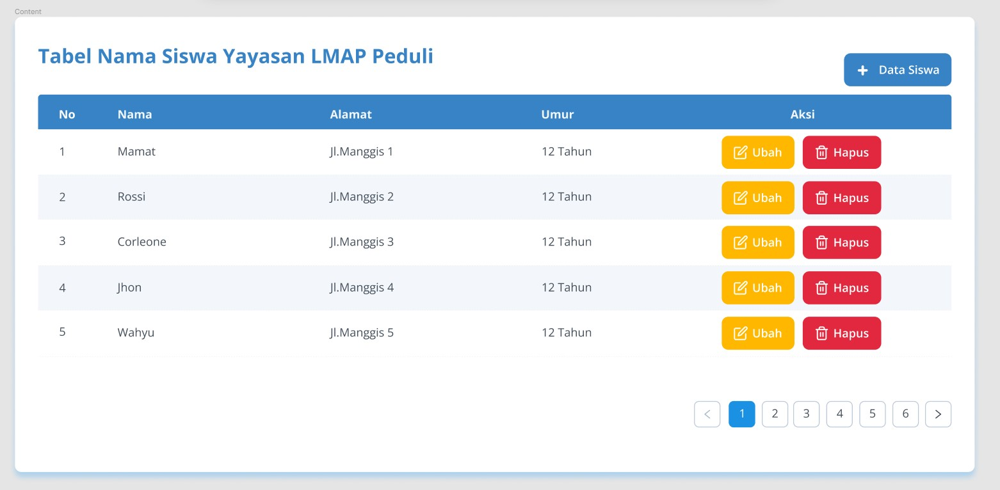
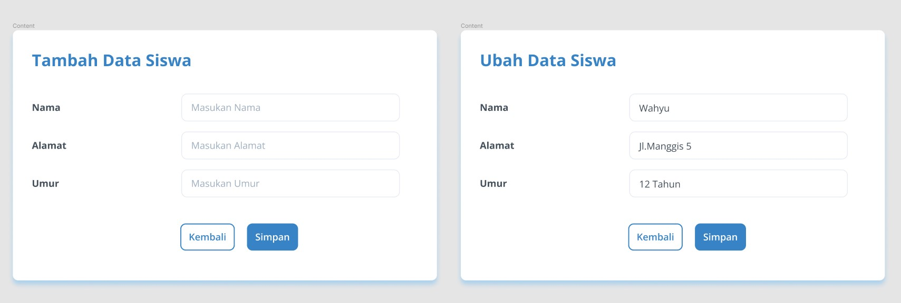

# Live Coding Instructions

## Objective

Build a simple web application that displays a dynamic list of items.

## Technologies

1. JavaScript/Typescript, CSS, TailwindCss, ANTD, RTK, etc. (you may use any frameworks or libraries if you prefer)
2. Feel free to use any IDE (Integrated Development Environment)

## Time Frame

**30 minutes**

## Tips/Hint:

1. Keep an eye on the time; prioritize functionality over perfection.
2. Explain your thought process and code decisions as you go.
3. Feel free to ask for help or clarification if you encounter challenges.
4. You can using blank React Project (Vite/CRA) or you can use our **[basecode](https://github.com/baguspurnama98/pod-live-coding-react-vite)**

MockUp:



## Challenge

1. Temukan kesalahan pada code ini?

```JSX
const {useState} = React

function App(){
    const [flag, toggleFlag] = useState(false)

    const handleOnClick = () => {
        toggleFlag(!flag)

        setTimeout(()=>{
          toggleFlag(!flag);
        }, 2000)
    }

   const ToastComp = () => <div>Hello World</div>

    return (
        <div>
          {flag && <ToastComp />}
          <button onClick={handleOnClick}>Show Toaster</button>
        </div>
    )
}
```

2. Temukan kesalahan pada code ini?

```JSX
const data = [{
  name: "Wahyu",
  age: 29,
  pet: { name: "cat", quantity: 2 }
},
{
  name: "Gamal",
  age: 27,
  pet: { name: "dog", quantity: 1 }
}]

const temp = [...data]

temp[indexSelected] = {
  ...temp[indexSelected],
  age: temp[indexSelected].age + 1,
  pet: {
    quantity: 5,
    ...temp[indexSelected].pet,
  }
}

```

3.  Apa nilai yang ditampilkan `<h1>` ?

```JSX
export default function App() {
  const [setCounterState, counterState] = useState(0);
  return (
    <div>
      <h1>{counterState}</h1>
    </div>
  );
}
```

4.  Apakah benar output log counter bernilai 1 2 3 4 5 jika handleOnClick dipanggil 5x? Jelaskan.?

```JSX
export default function App() {
  const [counterState, setCounterState] = useState(0);
  let counter = 0;

  const handleOnClick = () => {
    setCounterState(counterState + 1);
    counter++;
    console.log(counter);
  };

  return (
    <div>
      <h1>{counterState}</h1>
      <button onClick={() => handleOnClick()}>Click Me!</button>
    </div>
  );
}

```

5. Apakah benar output log counter bernilai 1 2 3 4 5 jika handleOnClick dipanggil 5x? Jelaskan.

```JSX
export default function App() {
  const [counterState, setCounterState] = useState(0);
  let counter = 0;

  const handleOnClick = () => {
    setCounterState(10000);
    counter++;
    console.log(counter);
  };

  return (
    <div>
      <h1>{counterState}</h1>
      <button onClick={() => handleOnClick()}>Click Me!</button>
    </div>
  );
}
```
